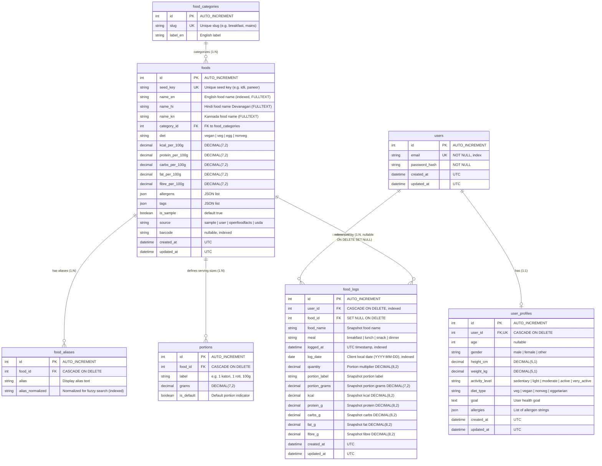

# NutriLens Entity-Relationship Diagram (Phase 2)

```mermaid
erDiagram
    users ||--o| user_profiles : "has (1:1)"
    users ||--o{ food_logs : "creates (1:N)"
    food_categories ||--o{ foods : "categorizes (1:N)"
    foods ||--o{ food_aliases : "has aliases (1:N)"
    foods ||--o{ portions : "defines serving sizes (1:N)"
    foods ||--o{ food_logs : "referenced by (1:N, nullable ON DELETE SET NULL)"

    users {
        int id PK "AUTO_INCREMENT"
        string email UK "NOT NULL, index"
        string password_hash "NOT NULL"
        datetime created_at "UTC"
        datetime updated_at "UTC"
    }

    user_profiles {
        int id PK "AUTO_INCREMENT"
        int user_id FK,UK "CASCADE ON DELETE"
        int age "nullable"
        string gender "male | female | other"
        decimal height_cm "DECIMAL(5,1)"
        decimal weight_kg "DECIMAL(5,1)"
        string activity_level "sedentary | light | moderate | active | very_active"
        string diet_type "veg | vegan | nonveg | eggetarian"
        text goal "User health goal"
        json allergies "List of allergen strings"
        datetime created_at "UTC"
        datetime updated_at "UTC"
    }

    food_categories {
        int id PK "AUTO_INCREMENT"
        string slug UK "Unique slug (e.g. breakfast, mains)"
        string label_en "English label"
    }

    foods {
        int id PK "AUTO_INCREMENT"
        string seed_key UK "Unique seed key (e.g. idli, paneer)"
        string name_en "English food name (indexed, FULLTEXT)"
        string name_hi "Hindi food name Devanagari (FULLTEXT)"
        string name_kn "Kannada food name (FULLTEXT)"
        int category_id FK "FK to food_categories"
        string diet "vegan | veg | egg | nonveg"
        decimal kcal_per_100g "DECIMAL(7,2)"
        decimal protein_per_100g "DECIMAL(7,2)"
        decimal carbs_per_100g "DECIMAL(7,2)"
        decimal fat_per_100g "DECIMAL(7,2)"
        decimal fibre_per_100g "DECIMAL(7,2)"
        json allergens "JSON list"
        json tags "JSON list"
        boolean is_sample "default true"
        string source "sample | user | openfoodfacts | usda"
        string barcode "nullable, indexed"
        datetime created_at "UTC"
        datetime updated_at "UTC"
    }

    food_aliases {
        int id PK "AUTO_INCREMENT"
        int food_id FK "CASCADE ON DELETE"
        string alias "Display alias text"
        string alias_normalized "Normalized for fuzzy search (indexed)"
    }

    portions {
        int id PK "AUTO_INCREMENT"
        int food_id FK "CASCADE ON DELETE"
        string label "e.g. 1 katori, 1 roti, 100g"
        decimal grams "DECIMAL(7,2)"
        boolean is_default "Default portion indicator"
    }

    food_logs {
        int id PK "AUTO_INCREMENT"
        int user_id FK "CASCADE ON DELETE, indexed"
        int food_id FK "SET NULL ON DELETE"
        string food_name "Snapshot food name"
        string meal "breakfast | lunch | snack | dinner"
        datetime logged_at "UTC timestamp, indexed"
        date log_date "Client local date (YYYY-MM-DD), indexed"
        decimal quantity "Portion multiplier DECIMAL(8,2)"
        string portion_label "Snapshot portion label"
        decimal portion_grams "Snapshot portion grams DECIMAL(7,2)"
        decimal kcal "Snapshot kcal DECIMAL(8,2)"
        decimal protein_g "Snapshot protein DECIMAL(8,2)"
        decimal carbs_g "Snapshot carbs DECIMAL(8,2)"
        decimal fat_g "Snapshot fat DECIMAL(8,2)"
        decimal fibre_g "Snapshot fibre DECIMAL(8,2)"
        datetime created_at "UTC"
        datetime updated_at "UTC"
    }
```
